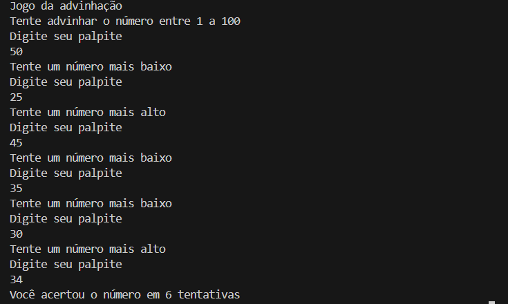

## Jogo da advinhação
O programa lança um número inteiro aleatório entre 1 e 100 e o usuário tenta acertar, a cada palpite o programa avisa se o número chutado é maior ou menor que o número aleatório.

> o programa fica no laço de repetição while até o usuário acertar o número;

> dentro do laço existem 3 estruturas condicionais para mostrar se o palpite chutado é maior ou menos que o número aleatório;

_Imagem do jogo funcionando no console_

